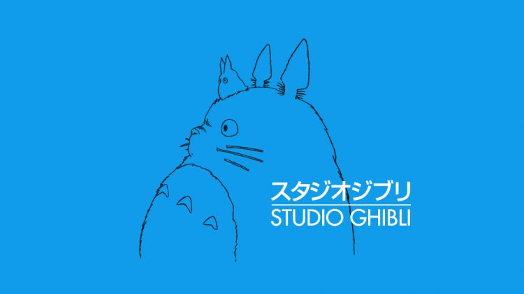
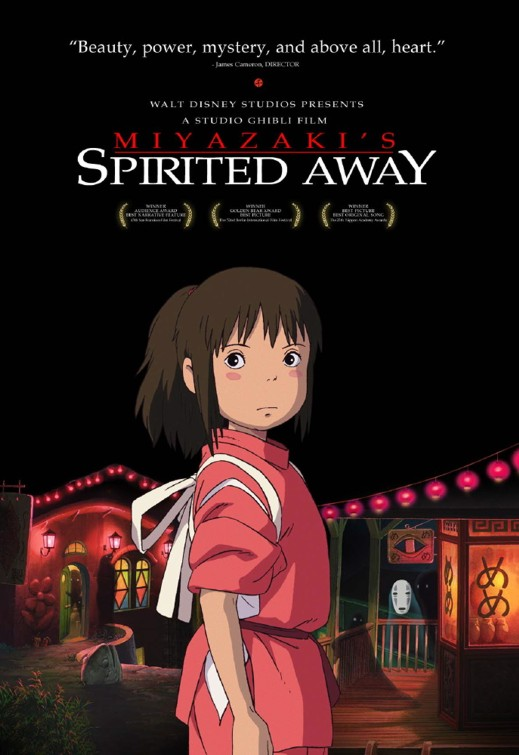
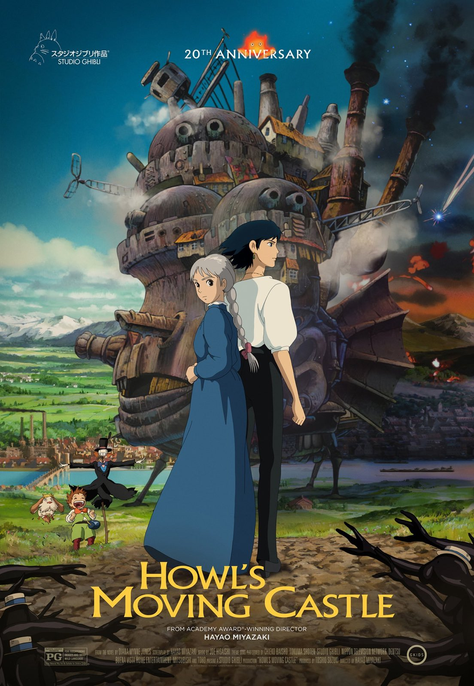
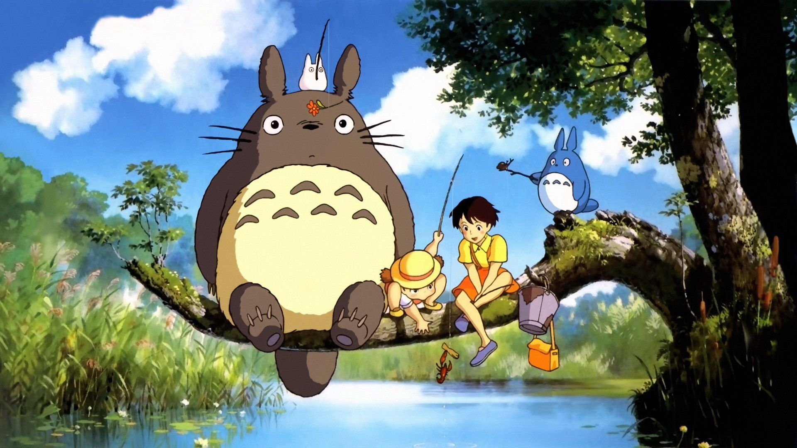
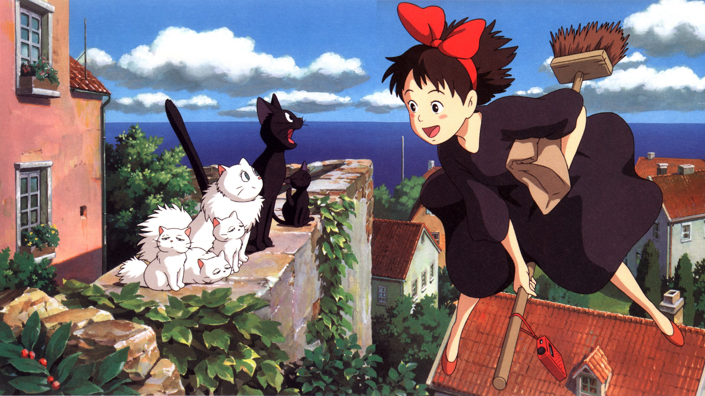
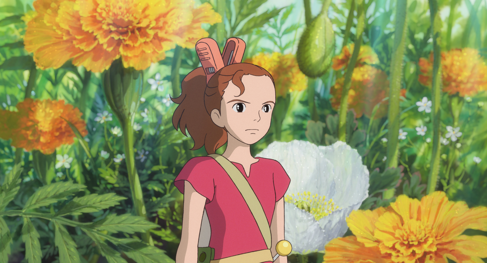

<!DOCTYPE html>
<html lang="en">
<head>
  <title>Bootstrap Example</title>
  <meta charset="utf-8">
  <meta name="viewport" content="width=device-width, initial-scale=1">
  <link href="https://cdn.jsdelivr.net/npm/bootstrap@5.3.3/dist/css/bootstrap.min.css" rel="stylesheet">
  
</head>
<body>

<!-- NAVBAR -->
<nav class="navbar navbar-expand-sm navbar-dark bg-dark">
  

    <a class="navbar-brand" href="javascript:void(0)">Beranda</a>
    <button class="navbar-toggler" type="button" data-bs-toggle="collapse" data-bs-target="#mynavbar">
      
    </button>
    

      <ul class="navbar-nav me-auto">
        <li class="nav-item">
          <a class="nav-link" href="javascript:void(0)">Profile</a>
        </li>
        <li class="nav-item">
          <a class="nav-link" href="javascript:void(0)">Daftar</a>
        </li>
      </ul>
      <form class="d-flex">
        <input class="form-control me-2" type="text" placeholder="Search">
        <button class="btn btn-primary" type="button">Search</button>
      </form>
    

  

</nav>

<!-- HEADER -->

  <h1>Ghibli Movies</h1>
  <h6>Top 3 Film Ghibli menurut saya</h6>
  </iframe>
  

  

<!-- CARD -->

  <h3>Top 1</h3>
  

    
    

      <h4 class="card-title">
Spirited Away
</h4>
      
Chihiro berkelana di sebuah dunia magis yang dikuasai oleh seorang penyihir. Semua orang yang tidak mematuhi sang penyihir akan diubah menjadi hewan.
         Film anime ciptaan Hayao Miyazaki ini menawarkan fantasi dengan gambar menggemaskan namun mampu menghangatkan hati melalui pesan-pesan mendalam terkait permasalahan sehari-hari tanpa harus merasa digurui.
      

      <a href="https://www.netflix.com/id/title/60023642" class="btn btn-primary">Watch Now!</a>
    

  

 
  <h3>Top 2</h3>
  

    
    

      <h4 class="card-title">
Howl's Moving Castle
</h4>
      
Sophie, seorang gadis remaja rata-rata yang bekerja di toko topi, menemukan hidupnya dilemparkan ke dalam kekacauan ketika dia benar-benar tersapu oleh seorang penyihir tampan tapi misterius bernama Howl. Setelah pertemuan kebetulan ini, dia berubah menjadi wanita berusia 90 tahun oleh Penyihir Sampah yang sia-sia dan licik. Memulai petualangan luar biasa untuk mengangkat kutukan, dia menemukan perlindungan di kastil ajaib Howl yang bergerak di mana dia berkenalan dengan Markl, murid Howl, dan iblis api berkepala panas bernama Calcifer.

      <a href="https://www.netflix.com/id-en/title/70028883" class="btn btn-primary">Watch Now!</a>
    

  

 
  <h3>Top 3</h3>
  

    
    

      <h4 class="card-title">
Ponyo
</h4>
      
Suatu pagi di dekat rumahnya di tepi pantai, Sosuke yang berusia lima tahun menemukan seekor ikan mas yang dia beri nama Ponyo, kepalanya tersangkut di stoples selai. Dia menyelamatkannya, dan terpesona satu sama lain, mereka berjanji untuk tetap berteman. Ketika ayah Ponyo, seorang penyihir bawah air yang kuat, memaksanya untuk kembali ke kedalaman laut, Ponyo bertekad untuk bergabung dengan Sosuke di permukaan dan menjadi manusia.

      <a href="https://www.netflix.com/id-en/title/70106454?source=35" class="btn btn-primary">Watch Now!</a>
    

  

  

<!-- Carousel -->

  <!-- Indicators/dots -->
  

    <button type="button" data-bs-target="#demo" data-bs-slide-to="0" class="active"></button>
    <button type="button" data-bs-target="#demo" data-bs-slide-to="1"></button>
    <button type="button" data-bs-target="#demo" data-bs-slide-to="2"></button>
  

  
  <!-- The slideshow/carousel -->
  

    

      
      

        <h3>My Neighbor Totoro</h3>
      

    

    

      
      

        <h3>Kiki Delivery Service</h3>
      
 
    

    

      
      

        <h3>The Secret World of Arrietty</h3>
      
  
    

  

  
  <!-- Left and right controls/icons -->
  <button class="carousel-control-prev" type="button" data-bs-target="#demo" data-bs-slide="prev">
    
  </button>
  <button class="carousel-control-next" type="button" data-bs-target="#demo" data-bs-slide="next">
    
  </button>

</body>
</html>

